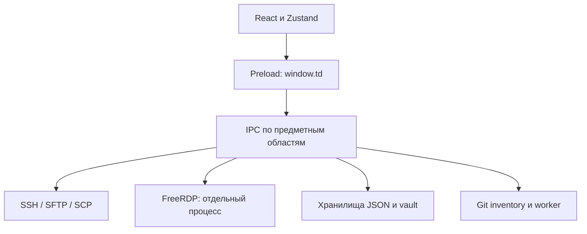

# Анализ кода и план работ TerminalDeck

Дата анализа: 15 сентября 2026 года.

## Итог

Код в ходе анализа не изменялся. Архитектуру можно развивать постепенно; сначала нужно закрыть риски потери данных, затем исправить жизненный цикл соединений.

Проверены основные подсистемы текущего проекта, включая незакоммиченные изменения: Electron, IPC, SSH/SFTP/SCP, RDP, vault, Git inventory, состояние интерфейса, тесты и релизные конфигурации.

### Результаты проверок

| Проверка | Результат |
| --- | --- |
| TypeScript | Проходит |
| ESLint | Проходит |
| Vitest | **703 passed, 7 skipped**, 80 файлов |
| `verify:release` | Контракт конфигураций проходит |
| Prettier | 240 расхождений, **все только CRLF/LF** |
| Дополнительные проверки в памяти | Воспроизведено 5 проблем |

Пропущенные тесты относятся к интеграции SCP, недоступной в текущем Windows-окружении. Сборка установщиков и подключения к реальным SSH/RDP-серверам не выполнялись.

Результаты относятся к состоянию рабочей копии на момент анализа. Это статический обзор основных подсистем с запуском существующих тестов и отдельными воспроизведениями на изолированных данных; он не заменяет проверку приложения на реальных серверах и поддерживаемых платформах.

## 1. Архитектура

В проекте 170 рабочих модулей TypeScript — около 30 тысяч строк вместе с комментариями, плюс нативная часть RDP на C.

Что уже сделано хорошо:

- Electron использует sandbox, context isolation и запрет произвольной навигации.
- Сохранённые RDP-пароли разрешаются в main process.
- Есть подтверждение доверия SSH-ключам и RDP-сертификатам.
- Вывод SSH ограничивается подтверждениями обработки; RDP также подтверждает кадры.
- Парсинг inventory вынесен в worker, SFTP-списки виртуализированы.
- JSON сохраняется через временный файл и переименование.
- В проверенных относительных импортах TS/TSX циклов не обнаружено.

Основная архитектурная проблема: **общие правила безопасности и завершения операций реализованы неодинаково в разных подсистемах**.

## 2. Первый приоритет: безопасность и сохранность данных

### 2.1. Выход из временной папки при редактировании удалённого файла

**Воспроизведено в памяти.**

`RemoteEdit` берёт имя через `split('/')`, затем передаёт его в Windows `path.join`. Имя Unix-файла с последовательностью `..\..\` воспринимается локально как переход между каталогами.

**Последствие:** скачивание для редактирования может записать файл за пределами выделенной временной папки.

**План:** единая проверка удалённых имён, запрет разделителей и специальных Windows-имён, проверка итогового пути перед записью.

Источник: [RemoteEdit.ts](src/main/ssh/RemoteEdit.ts), строка 104 на момент анализа.

### 2.2. Inventory читает переменные за пределами checkout

**Воспроизведено в памяти.**

Имя группы или хоста подставляется в путь `group_vars`/`host_vars` без проверки границ. Например, `../../outside` приводит к чтению внешнего YAML-файла. Проверка основных inventory-путей также ограничивается текстовым путём и не учитывает переход через symlink.

**План:** проверять имена и реальные пути, ограничить чтение корнем checkout, явно обрабатывать ссылки и ошибки YAML.

Источник: [files.ts](src/main/inventory/files.ts), строка 21 на момент анализа.

### 2.3. Vault допускает уничтожение секретов и отмену блокировки

**Обе проблемы воспроизведены в памяти.**

- Повторный `create()` заменяет существующее хранилище пустым.
- Если вызвать `lock()` во время вычисления ключа в `unlock()`, завершившийся `unlock()` снова откроет хранилище.

В `changePassword()` защита от подобных гонок уже есть, но она не распространяется на остальные операции.

**План:** единый механизм последовательного выполнения операций, отмена устаревших результатов, запрет повторного создания, проверка пароля в main process.

Источник: [Vault.ts](src/main/vault/Vault.ts), строка 47 на момент анализа.

### 2.4. Загрузка на сервер может повредить существующий файл

`upload()` пишет непосредственно в конечный файл через `fastPut`; передача между серверами также открывает конечный путь для записи.

**Последствие:** при разрыве связи старый файл уже может быть обрезан или частично заменён. Решение о конфликте принимается заранее, без повторной проверки перед записью.

**План:** загрузка во временный соседний файл, проверка результата, финальное переименование с учётом возможностей сервера; повторная проверка назначения перед заменой.

Источник: [SFTPManager.ts](src/main/ssh/SFTPManager.ts), строка 284 на момент анализа.

### 2.5. RDP продолжает обмен буфером при блокировке приложения

Опрос clipboard не проверяет состояние vault, фокус окна или активную панель. Изменения отправляются всем готовым RDP-сессиям с включённым clipboard; по умолчанию он включён.

**Последствие:** скопированные в другом приложении данные могут уйти в фоновые RDP-сессии после блокировки TerminalDeck.

**План:** приостанавливать обмен при блокировке и явно определить, какая сессия получает локальный буфер.

Источник: [FreeRdpBridge.ts](src/main/rdp/FreeRdpBridge.ts), строка 334 на момент анализа.

## 3. Второй приоритет: зависания и согласованность состояния

### 3.1. SSH и запросы пароля

**Утечка соединения воспроизведена:** отмена пароля целевого хоста оставляет уже подключённый jump host без `end()`.

Кроме того, интерфейс хранит только один запрос аутентификации. При массовом подключении следующий запрос заменяет предыдущий; первый остаётся ждать ответа. Для запроса пароля до начала SSH-handshake собственного тайм-аута нет.

**План:** очередь запросов с идентификаторами, отмена подключения целиком, гарантированное закрытие всех созданных клиентов при любой ошибке.

Источники:

- [SSHManager.ts](src/main/ssh/SSHManager.ts), строка 345 на момент анализа.
- [AuthPromptDialog.tsx](src/renderer/src/components/AuthPromptDialog.tsx), строка 17 на момент анализа.

### 3.2. Сохранение и импорт

Атомарная запись отдельного JSON-файла уже есть, но:

- хранилища меняют состояние в памяти **до** успешной записи;
- импорт последовательно обновляет секреты и несколько хранилищ без общего отката;
- отсутствует защита от двух одновременно запущенных экземпляров, сохраняющих собственные копии данных.

**Последствие:** ошибка диска или конкурирующая запись может оставить память, файлы и интерфейс в разных состояниях.

**План:** один владелец записи, подготовка нового состояния до сохранения, пакетный импорт с восстановлением после сбоя, проверка схем и связей между объектами.

Источники:

- [SessionStore.ts](src/main/store/SessionStore.ts), строка 52 на момент анализа.
- [Backup.ts](src/main/store/Backup.ts), строка 467 на момент анализа.
- [index.ts](src/main/index.ts) — жизненный цикл приложения.

### 3.3. Остальные важные места

| Область | Наблюдение | Что запланировать |
| --- | --- | --- |
| Git inventory | Завершившаяся синхронизация может применить результат после удаления или изменения источника | Проверять актуальность источника и версии запроса |
| Git folders | Preview не привязан к неизменной версии настроек репозитория | Инвалидировать preview при изменении URL, ветки и путей |
| Electron | Очистка соединений во многом зависит от React unmount | Очистка в main при уничтожении/сбое renderer |
| Updater | Обработчики навсегда захватывают первое окно | Перепривязка уведомлений при создании нового окна на macOS |
| Терминал | Собственная вставка отправляет текст напрямую, обходя механизм bracketed paste xterm | Использовать режим вставки терминала, проверить многострочный текст и broadcast |
| Передача каталогов | План состоит из файлов; пустые каталоги теряются | Представлять каталоги отдельными элементами плана |
| IPC | Типы TypeScript не проверяют входящие данные во время выполнения | Схемы аргументов, проверка отправителя и принадлежности соединения |
| Нативный RDP | Очереди команд и завершение reader thread требуют дополнительной проверки | Лимиты, тесты остановки, проверки памяти и потоков |

Последняя строка — **область дополнительной проверки**, а не подтверждённое падение.

Связанные модули:

- [InventoryStore.ts](src/main/inventory/InventoryStore.ts).
- [GitFolderStore.ts](src/main/gitFolders/GitFolderStore.ts).
- [updater.ts](src/main/updater.ts).
- [TerminalHost.tsx](src/renderer/src/components/TerminalHost.tsx).
- [IPC handlers](src/main/ipc/handlers.ts).
- [td_rdp.c](resources/freerdp/shim/td_rdp.c) и [td_proto.c](resources/freerdp/shim/td_proto.c).

## 4. Поддерживаемость и тесты

Самые сложные компоненты — `Sidebar`, `RemoteScreen`, `SftpPanel`, примерно по тысяче строк. В них смешаны отображение, обработка событий и управление длительными операциями.

**План упрощения:**

- вынести жизненный цикл соединения из компонентов;
- выделить управление передачами файлов;
- централизовать поиск хоста и разрешение настроек;
- унифицировать отображение ошибок асинхронных операций;
- после исправлений обновить документацию и граф связей — текущий граф датирован 11 августа 2026 года.

Тестовая база полезная, но число успешных тестов не покрывает перечисленные сценарии. Нужны проверки:

- параллельной аутентификации;
- отмены на каждом этапе подключения;
- блокировки во время асинхронных операций;
- ошибок записи и прерванного импорта;
- разрыва передачи во время замены файла;
- перезагрузки renderer и повторного открытия окна;
- реальной работы Windows clipboard, фокуса и RDP.

Нативные тесты уже запускаются сборочными скриптами. Платформенные проверки стоит выполнять раньше этапа выпуска: обычный CI сейчас работает на Ubuntu.

Расхождения Prettier вызваны окончаниями строк при включённом `core.autocrlf`. Нужно согласовать правила Git и форматтера, прежде чем выполнять массовое форматирование.

## 5. Порядок реализации

| Этап | Содержание | Критерий готовности |
| --- | --- | --- |
| **1. Защита границ** | Пути RemoteEdit/inventory, операции vault, clipboard при блокировке | Воспроизведённые сценарии закрыты регрессионными тестами |
| **2. Надёжные подключения** | Очередь паролей, отмена SSH-цепочек, очистка ресурсов | После отмены и ошибки не остаётся клиентов, запросов и слушающих портов |
| **3. Сохранность данных** | Безопасная замена файлов, пакетный импорт, согласованная запись хранилищ | Прерывание операции сохраняет прежние данные либо оставляет восстанавливаемое состояние |
| **4. Согласованность приложения** | Устаревшие sync/preview, жизненный цикл окон, updater, IPC | Поздние ответы не восстанавливают удалённые объекты и не обращаются к старому окну |
| **5. Упрощение и выпуск** | Разделение крупных компонентов, платформенные проверки, документация, окончания строк | Проверки воспроизводимы на поддерживаемых платформах |

**Начинать предлагается с этапа 1.** Затем — очередь аутентификации и очистка SSH: эти изменения дадут наиболее заметный эффект при ежедневной работе.

## 6. Невыполненная внешняя проверка зависимостей

`npm audit` не выполнен. Автоматическая проверка разрешений отклонила запрос, поскольку команда передаёт список пакетов и их версий в публичный npm registry, а разрешение на передачу потенциально непубличных метаданных проекта не было получено.

Для этой отдельной проверки требуется разрешение на передачу списка зависимостей в npm registry. Актуальные сведения об известных npm-уязвимостях в результаты данного анализа не входят.

## Статус плана

Обновлено 15 сентября 2026 года: этапы 1–5 выполнены в рабочей копии, изменения не закоммичены. Подробности — в разделе «Unreleased» файла CHANGELOG.md.

| Пункт | Что сделано | Где |
| --- | --- | --- |
| 2.1 RemoteEdit | Имена чинятся и проверяются против папки; при скачивании отклоняются имена, опасные для Windows (`\`, `:`, `NUL`, точка в конце) | `src/main/localName.ts` |
| 2.2 Inventory | Имена с разделителями игнорируются, файлы проверяются по реальному пути (symlink, junction) | `inventory/checkout.ts`, `files.ts` |
| 2.3 Vault | Отказ от повторного `create`, операции идут последовательно, `lock` отменяет незавершённые, длина пароля проверяется в main | `vault/Vault.ts` |
| 2.4 Загрузка | Запись во временный соседний файл и замена с сохранением mode/owner; если это невозможно — запись на месте, как раньше; перед записью назначение проверяется повторно | `SFTPManager.writeRemoteFile`, `ScpShell.replace` |
| 2.5 Clipboard RDP | Обмен идёт только при открытом vault и окне в фокусе, в обе стороны | `rdp/FreeRdpBridge.ts` |
| 3.1 SSH | Очередь запросов, отмена подключения из панели, закрытие всех клиентов цепочки, тайм-аут запроса 5 минут | `SSHManager.ts`, `authPrompt.ts`, `AuthPromptDialog.tsx` |
| 3.2 Хранилища | Память меняется только после успешной записи, импорт «всё или ничего» с проверкой связей, запуск только одного экземпляра | `store/jsonFile.ts` (JsonDocument), `Backup.ts`, `index.ts` |
| 3.3 Остальное | Устаревшие sync/preview отбрасываются; сессии закрываются при reload, падении renderer или закрытии окна; updater пишет в актуальное окно; вставка через `term.paste`; пустые каталоги переносятся; проверка отправителя IPC и формы плана передачи; устранено обращение к освобождённой памяти при завершении td-rdp | `InventoryStore`, `GitFolderStore`, `index.ts`, `updater.ts`, `ipc/guard.ts`, `td_rdp.c` |
| 4 Упрощение | Поиск хоста в main вынесен в один модуль, выполнение передач вынесено из `SftpPanel` в хук | `store/hosts.ts`, `hooks/useTransfers.ts` |
| 4 Платформы и окончания строк | Тесты также запускаются в CI на Windows и macOS, окончания строк задаются в `.gitattributes` | `.github/workflows/ci.yml` |

Проверки: TypeScript, ESLint и `verify:release` проходят; Vitest — 749 passed, 7 skipped; `npm run build` проходит; shim td-rdp пересобран под Windows, нативные тесты проходят. Сборка запущена с изолированной папкой данных: IPC работает через проверку отправителя, повторный `create` и гонка `lock`/`unlock` ведут себя как задумано, второй экземпляр завершается сразу.

Не сделано:
- Реальные SSH/RDP-серверы и macOS не проверялись.
- Sidebar и RemoteScreen не разбивались.
- Схемы аргументов добавлены только для плана передачи, не для каждого канала IPC.
- Граф graphify не пересобирался.
- `npm audit` не запускался.
